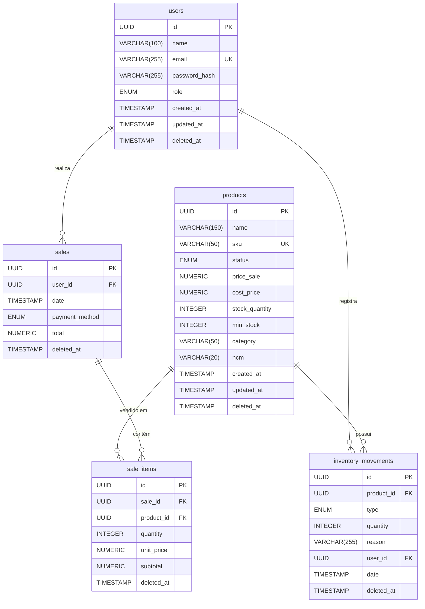
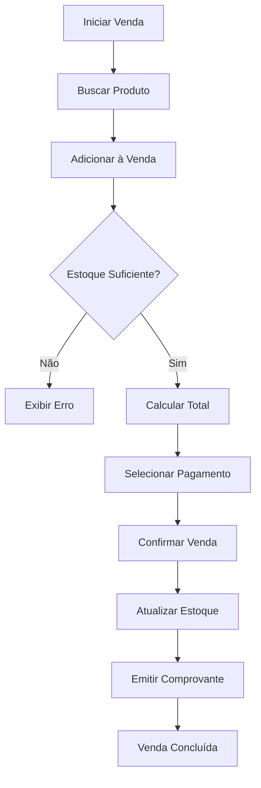

# StockUp Manager 
## 🎯 Visão Geral

StockUp Manager é um aplicativo de gerenciamento de estoque com mini PDV (Ponto de Venda) projetado para pequenos negócios. Permite CRUD de produtos, autenticação de usuários (admin/vendedor), registro de vendas com atualização automática de estoque, relatórios simples e modo offline via PWA. Ideal para controle rápido e seguro de estoque e vendas.

## 📋 Índice
- [Visão Geral](#-visão-geral)
- [Funcionalidades](#-funcionalidades)
- [Arquitetura e Tecnologias](#-arquitetura-e-tecnologias)
- [Diagramas](#-diagramas)
- [API Documentation](#-api-documentation)
- [Instalação e Configuração](#-instalação-e-configuração)
- [Deploy e Infraestrutura](#-deploy-e-infraestrutura)
- [Desenvolvimento](#-desenvolvimento)
- [Contribuição](#-contribuição)
- [Licença](#-licença)

**Status do Projeto**: MVP (Minimum Viable Product)


# (Em Produção ...)


## ✨ Funcionalidades

### Principais Módulos
- **Gestão de Produtos**: Cadastro, edição e exclusão de produtos
- **Controle de Estoque**: Movimentações de entrada, saída e ajustes
- **Ponto de Venda (PDV)**: Registro de vendas com múltiplas formas de pagamento
- **Relatórios**: Geração de relatórios diários e produtos mais vendidos
- **Autenticação**: Sistema de login com perfis de usuário (Admin/Vendedor)
- **Operação Offline**: Funcionalidade PWA com sincronização automática

### Regras de Negócio
- RN-001: Estoque sempre atualizado por movimentações
- RN-002: Venda só pode ser confirmada com estoque suficiente
- RN-003: Ajuste de estoque exige motivo
- RN-004: Usuário vendedor não pode lançar entrada ou ajuste

## 🏗️ Arquitetura e Tecnologias

### Backend
- **Java 17+** com Spring Boot
- **Spring Data JPA** para persistência
- **PostgreSQL** como banco principal
- **JWT** para autenticação
- **Maven** para gerenciamento de dependências

### Frontend
- **Angular 15+** com TypeScript
- **PWA** (Progressive Web App) para funcionamento offline
- **Bootstrap** para componentes de UI

### Infraestrutura
- **Docker** para containerização
- **GitHub Actions** para CI/CD
- **Railway/Render** para deploy
- **PostgreSQL gerenciado** (Supabase/Neon)

## 📊 Diagramas

### Diagrama de Entidade-Relacionamento


### Fluxo de Venda


## 📡 API Documentation

### Endpoints Principais

#### Autenticação
| Método | Endpoint | Descrição |
|--------|----------|-----------|
| POST | `/api/auth/login` | Autenticação de usuário |

#### Produtos
| Método | Endpoint | Descrição |
|--------|----------|-----------|
| GET | `/api/products` | Listar produtos |
| POST | `/api/products` | Criar produto |
| GET | `/api/products/{id}` | Obter produto por ID |
| PUT | `/api/products/{id}` | Atualizar produto |
| DELETE | `/api/products/{id}` | Excluir produto (soft delete) |

#### Vendas
| Método | Endpoint | Descrição |
|--------|----------|-----------|
| POST | `/api/sales` | Registrar venda |
| GET | `/api/sales` | Listar vendas (com filtro de data) |

#### Relatórios
| Método | Endpoint | Descrição |
|--------|----------|-----------|
| GET | `/api/reports/top-products` | Produtos mais vendidos |
| GET | `/api/reports/low-stock` | Produtos com estoque baixo |

### Exemplo de Requisição
```bash
curl -X POST "http://localhost:8080/api/auth/login" \
  -H "Content-Type: application/json" \
  -d '{"email": "admin@example.com", "password": "senha123"}'
```

### Exemplo de Resposta
```json
{
  "token": "eyJhbGciOiJIUzI1NiIsInR5cCI6IkpXVCJ9...",
  "user": {
    "id": "018b5e0a-0000-7000-a000-000000000000",
    "name": "Admin User",
    "email": "admin@example.com",
    "role": "ADMIN"
  }
}
```

## 🚀 Instalação e Configuração

### Pré-requisitos
- Java 17+
- Node.js 16+
- PostgreSQL 12+
- Maven 3.6+

### Backend
```bash
# Clonar repositório
git clone https://github.com/seu-usuario/estoque-vendas-api.git
cd estoque-vendas-api

# Configurar banco de dados
# Editar application.properties com suas credenciais

# Executar aplicação
mvn spring-boot:run
```

### Frontend
```bash
# Clonar repositório
git clone https://github.com/seu-usuario/estoque-vendas-frontend.git
cd estoque-vendas-frontend

# Instalar dependências
npm install

# Executar em desenvolvimento
ng serve
```

### Variáveis de Ambiente
```bash
# Backend
DATABASE_URL=jdbc:postgresql://localhost:5432/estoque
DATABASE_USERNAME=usuario
DATABASE_PASSWORD=